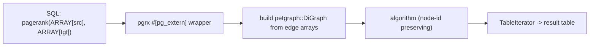

# pg_petgraph

[](https://github.com/alitrack/pg_petgraph/actions/workflows/ci.yml)
[](LICENSE)
[](https://www.postgresql.org/)

Graph algorithms for PostgreSQL, written in Rust with [pgrx](https://github.com/pgcentralfoundation/pgrx) and [petgraph](https://github.com/petgraph/petgraph).

**No new query language, no graph namespace, no separate storage** — you pass two `bigint[]` arrays (sources, targets) to a SQL function and get a result table back. Ten algorithms covering centrality, connectivity, community detection, ordering and cycle checking.

```sql
CREATE EXTENSION pg_petgraph;

SELECT * FROM pagerank(ARRAY[1,2,3,2,4], ARRAY[2,3,1,4,1]);
-- columns: node_id bigint, score double precision
```

## Functions

All functions take `sources bigint[]` and `targets bigint[]` describing the edges of an **unweighted directed graph**, and return a table.

| Function | Signature | Returns |
|---|---|---|
| `pagerank` | `pagerank(sources, targets, damping => 0.85, max_iter => 100)` | `(node_id, score)` |
| `scc` | `scc(sources, targets)` | `(node_id, component_id)` — Kosaraju |
| `connected_components` | `connected_components(sources, targets)` | `(node_id, component_id)` — weakly connected |
| `betweenness` | `betweenness(sources, targets)` | `(node_id, centrality)` — Brandes |
| `closeness` | `closeness(sources, targets)` | `(node_id, centrality)` |
| `eigenvector` | `eigenvector(sources, targets, max_iter => 100, tolerance => 1e-6)` | `(node_id, centrality)` |
| `louvain` | `louvain(sources, targets)` | `(node_id, community_id)` |
| `dijkstra` | `dijkstra(sources, targets, start_node)` | `(node_id, distance)` — single source |
| `toposort` | `toposort(sources, targets)` | `(position, node_id)` |
| `is_cyclic` | `is_cyclic(sources, targets)` | `boolean` |

Usage:

```sql
-- PageRank
SELECT * FROM pagerank(
    ARRAY[1, 2, 3, 2, 4],
    ARRAY[2, 3, 1, 4, 1],
    damping => 0.85,
    max_iter => 100
);

-- Strongly connected components
SELECT * FROM scc(ARRAY[1,2,3], ARRAY[2,3,1]);

-- Betweenness centrality
SELECT * FROM betweenness(ARRAY[1,1,1], ARRAY[2,3,4]);

-- Single-source shortest path
SELECT * FROM dijkstra(ARRAY[1,1,2], ARRAY[2,3,3], 1);

-- Cycle check — handy as a WHERE-clause guard
SELECT is_cyclic(ARRAY[1,2], ARRAY[2,1]);

-- Community detection
SELECT * FROM louvain(ARRAY[1,1,2,3], ARRAY[2,3,3,4]);
```

## Why another graph extension?

| Project | Route | Why it is not a substitute |
|---|---|---|
| [Apache AGE](https://github.com/apache/age) | openCypher query language + graph namespace inside PostgreSQL | Actively developed, but you adopt Cypher and graph objects; it is a graph-database layer, not a set of plain SQL functions |
| [Apache MADlib](https://github.com/apache/madlib) | Full machine-learning suite | Graph algorithms are a small part of a large dependency; not graph-focused |
| [pgRouting](https://github.com/pgRouting/pgrouting) | Road-network routing | Focused on pathfinding over topology, not centrality / community detection |

`pg_petgraph` takes the plain-SQL route: two arrays in, a table out, no new language and no new storage layer. It is aimed at the case where you already have edges in a table and want a centrality or community number in the same `SELECT` that produced them.

## How it works



Node identifiers are `bigint` and are preserved as-is on output; only edges are needed (isolated nodes are not representable, since they never appear in either array).

## Installation

### From source

Requires Rust 1.96+ and a PostgreSQL 15/16/17 development environment.

```bash
cargo install cargo-pgrx --version 0.13.1 --locked
cargo pgrx init --pg17 /usr/bin/pg_config

git clone https://github.com/alitrack/pg_petgraph.git
cd pg_petgraph
cargo pgrx install --release --pg-config /usr/bin/pg_config
```

Then, in psql:

```sql
CREATE EXTENSION pg_petgraph;
```

### Supported versions

Cargo features `pg15`, `pg16`, `pg17` (default: `pg17`). CI runs `cargo pgrx test` on **PostgreSQL 16 and 17**; the `pg15` feature is provided but not covered by CI.

## Scope and limits

- **Unweighted directed graphs** — no edge-weight argument yet.
- **In-memory** — the whole edge list is materialised per call; suited to graphs that fit comfortably in memory, not to billion-edge graphs on disk.
- **Whole-graph functions** — each call recomputes over the full edge set; there is no incremental or precomputed index.
- Not a routing engine — `dijkstra` returns distances from one source; there is no A*, turn restriction or topology handling.

## Sibling project

[`duckdb_petgraph`](https://github.com/alitrack/duckdb_petgraph) — the same idea for DuckDB. Graph algorithms should not require a graph database, whichever of the two you happen to be sitting in.

## License

MIT — see [LICENSE](LICENSE).
